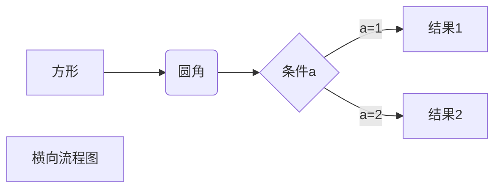

# 一级标题  


## 二级标题


我是一棵树  


我是一棵大树  

*我是一棵树*

**我是一棵大树**

***我是一棵又高又大的树***

***

~~我是一棵槐树~~  

<u>我是一棵桦树</u>  

我是一棵树：[^TREE]  

[^TREE]: 树，桦树，又高又大的桦树。  

---

* 第一项  

* 第二项
* 第三项

---

1. 第一
2. 第二

---

1. 一
   - 第一个元素
2. 二
   - 第一个元素

---

> 我是一棵大树
>
> 我是一棵大大树
>
> 我是一棵大大大树  
>
> > 我是一片树叶
> >
> > > 我是一个虫子

---

`print()` 函数

```c++
cout<<"hello"<<endl;
```

---

这是一个[树](https://baike.baidu.com/item/%E6%A0%91%E5%BD%A2%E7%BD%91%E7%BB%9C/2687917?fr=aladdin)  

这是一个[树木][1]  

[1]:https://changkun.de/modern-cpp/zh-cn/appendix1/index.html

---

这个链接用 1 作为网址变量 [RUNOOB][1].
然后在文档的结尾为变量赋值（网址）

[1]: http://static.runoob.com/images/runoob-logo.png


___

| 表头 | 表头 |
| ---- | ---- |
|      |      |
|      |      |
|      |      |
|      |      |
|      |      |

---

使用<kbd>Ctrl</kbd>+<kbd>ALT</kbd>+<kbd>Del</kbd> 重启电脑

**文本加粗**

\*\* 正常显示星号 \*\*  



```sequence
Title: 标题：复杂使用
对象A->对象B: 对象B你好吗?（请求）
Note right of 对象B: 对象B的描述
Note left of 对象A: 对象A的描述(提示)
对象B-->对象A: 我很好(响应)
对象B->小三: 你好吗
小三-->>对象A: 对象B找我了
对象A->对象B: 你真的好吗？
Note over 小三,对象B: 我们是朋友
participant C
Note right of C: 没人陪我玩
```

